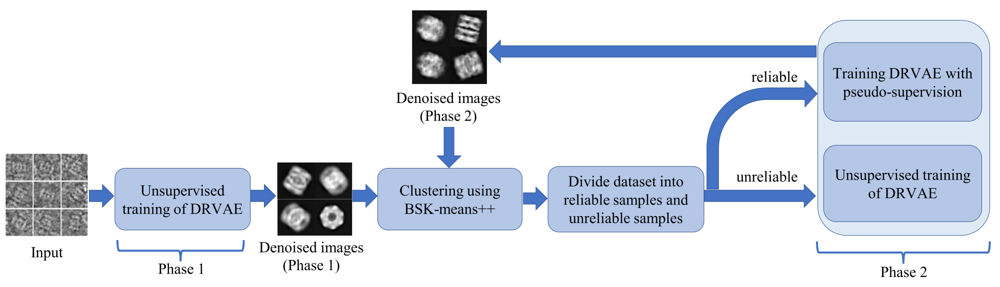

# Unsupervised Cryo-EM Images Denoising and Clustering based on Deep Convolutional Autoencoder and K-Means++
The repository includes codes for reproducing work in paper *Unsupervised Cryo-EM Images Denoising and Clustering based on Deep Convolutional Autoencoder and K-Means++*

The proposed method contains two modules: a denoising ResNet variational autoencoder (DRVAE), and Balance size K-means++ (BSK-means++). First, the DRVAE is trained in a fully unsupervised manner to initialize the neural network and obtain preliminary denoised images. Second, BSK-means++ is built for clustering denoised images, and images closer to class centers are divided into reliable samples. Third, the training of DRVAE is continued, while the class-average images are used as pseudo supervision of reliable samples to reserve more detailed information of denoised images. Finally, the second and third steps mentioned above can be performed jointly and iteratively until convergence occurs. The experimental results showed that the proposed method can generate reliable class average images and achieve better clustering accuracy and normalized mutual information than current methods. 

The figure below shows the prediction model's architecture,

**Usage**

(1) Eidit 'path_result_dir' and 'path_data' in 'settings.yml'. 'path_result_dir' is the directory that will save the clustering result including clustering labels and average images. 'path_data' is the directory that you save the .mrc(s) files to be clustered.

(2) Run 'DRVAE_BSKMeans.py'
